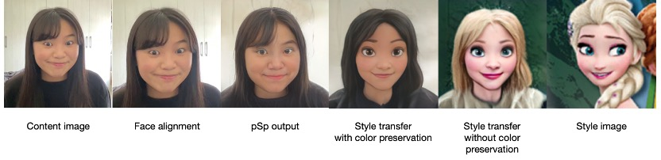
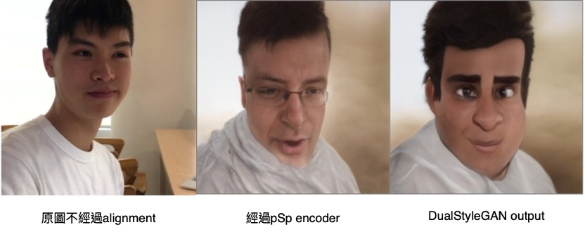

# VideoFaceStyleTransfer_MethodResearch

Video1：DualStyleGAN 會針對每個frame的人臉做face alignment，可以看到右上方格中的人頭一直在變換角度。 
而右下方格轉換後的影片，髮流等細微結構一直在跳動，很不連續 

  

Video2：VToonify 的效果很流暢 

  

DualStyleGAN 轉換後的影片會忽略人臉周圍的其他部位（例如：手指、吸管） 

  

VToonify 保留了手和吸管（雖然有點透明化） 

  

DualStyleGAN的轉換過程  

