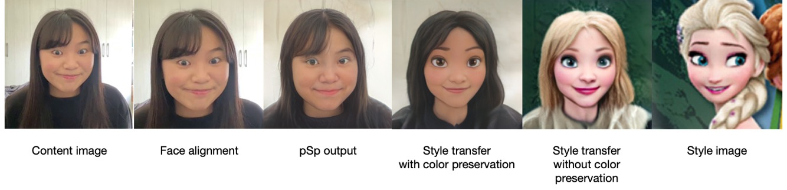

# VideoFaceStyleTransfer_MethodResearch

Video1：DualStyleGAN 會針對每個frame的人臉做face alignment，可以看到右上方格中的人頭一直在變換角度。 
而右下方格轉換後的影片，髮流等細微結構一直在跳動，很不連續 

      

https://user-images.githubusercontent.com/99737139/196706791-2e826d98-f838-434c-846f-03105cff73b5.mp4

Video2：VToonify 的效果很流暢 

Video3：DualStyleGAN 轉換後的影片會忽略人臉周圍的其他部位（例如：手指、吸管） 

https://user-images.githubusercontent.com/99737139/196706941-c49d83f9-c788-4384-9412-7c5b05730d19.mp4

Video4：VToonify 保留了手和吸管（雖然有點透明化） 

https://user-images.githubusercontent.com/99737139/196707020-6a8c4ccb-54d6-47ee-9ea8-72131abfc3f2.mp4

DualStyleGAN的轉換過程  

結合 MediaPipe Selfie Segmentation 的功能：將人物與背景分離並換上其他背景，但我們發現邊緣處理不是很好

https://user-images.githubusercontent.com/99737139/197837957-7aa5423d-381b-4c10-845f-83fdd3225a46.mp4

https://user-images.githubusercontent.com/99737139/197839434-905eeb8c-1de9-4571-bc90-b435a3b8608a.mp4

